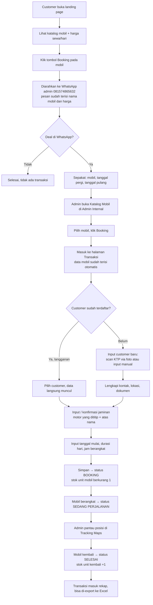

# 02 — Alur Bisnis

Dokumen ini menjelaskan perjalanan lengkap dari customer melihat website sampai
mobil kembali dan transaksi ditutup.

## Diagram Alur

## Penjelasan Per Tahap

### Tahap 1 — Customer menemukan mobil (landing page)

Customer membuka website dan melihat katalog. Setiap kartu mobil menampilkan
foto, nama, spesifikasi ringkas, dan **harga jual per hari**. Harga modal tidak
pernah ditampilkan di sisi publik.

### Tahap 2 — Perpindahan ke WhatsApp

Customer menekan tombol booking pada mobil yang diminati. Website membuka
WhatsApp ke nomor admin **081574865632** dengan pesan yang sudah terisi
otomatis, minimal berisi nama mobil dan harga per hari, supaya admin langsung
tahu mobil mana yang ditanyakan.

Format tautan yang dipakai: `https://wa.me/6281574865632?text=<pesan>`
(nomor ditulis format internasional tanpa `+` dan tanpa `0` di depan).

Contoh isi pesan:

> Halo Admin RentCar, saya tertarik menyewa **Toyota Avanza** (Rp 350.000/hari).
> Apakah masih tersedia?

### Tahap 3 — Negosiasi & kesepakatan (di luar sistem)

Percakapan terjadi sepenuhnya di WhatsApp. Yang harus tercapai sebelum masuk
sistem:

- Mobil yang disepakati
- Tanggal pergi dan tanggal pulang (atau durasi)
- Jam berangkat
- Jaminan yang akan dititipkan

### Tahap 4 — Admin membuat booking dari katalog internal

Admin login ke Admin Internal, membuka **Katalog Mobil**, memilih mobil yang
disepakati, lalu menekan tombol **Booking**. Sistem memindahkan admin ke
halaman **Transaksi** dengan data mobil sudah terisi otomatis (nama, harga jual
per hari, harga modal per hari, unit yang dipilih).

### Tahap 5 — Menentukan customer

Dua kemungkinan:

- **Customer langganan** — admin mencari nama/No. HP, data lama langsung
  muncul lengkap dengan dokumen dan jaminan yang tersimpan.
- **Customer baru** — admin menginput data. Ada dua jalur input:
  1. **Scan KTP via foto** — admin memotret/mengunggah KTP, sistem membaca
     teksnya (OCR) dan mengisi field secara otomatis. Hasilnya tampil sebagai
     teks yang **masih bisa dikoreksi admin** sebelum disimpan. Foto KTP yang
     dipakai untuk scan **otomatis tersimpan** ke daftar dokumen customer.
  2. **Input manual** — kalau scan gagal atau tidak dipakai, admin mengetik
     sendiri seluruh data sesuai yang tertera di KTP.

Detail field ada di [05 — Model Data](05-model-data.md).

### Tahap 6 — Jaminan

Customer menitipkan jaminan, umumnya **motor**. Yang dicatat: motor apa yang
dititipkan dan atas nama siapa.

Jaminan tersimpan di data customer supaya bisa dipakai lagi di transaksi
berikutnya, **tetapi bisa diinput ulang per transaksi** kalau kendaraan yang
dititipkan berbeda dari yang tersimpan.

### Tahap 7 — Input detail sewa

Admin mengisi:

- **Tanggal mulai sewa**
- **Durasi (hari)**
- **Jam berangkat**

Tanggal selesai dihitung otomatis dari tanggal mulai + durasi. Total biaya
dihitung otomatis dari harga jual per hari × durasi.

Setelah disimpan, status transaksi menjadi **Booking** dan jumlah unit tersedia
untuk mobil tersebut **berkurang satu**.

### Tahap 8 — Siklus status

| Status | Arti | Efek ke stok |
|---|---|---|
| **Booking** | Sudah dipesan, mobil belum berangkat | Unit tersedia −1 |
| **Sedang Perjalanan** | Mobil sudah dibawa customer | Tetap terpakai |
| **Selesai** | Mobil sudah kembali, sewa berakhir | Unit tersedia +1 |

Perpindahan status dilakukan manual oleh admin.

### Tahap 9 — Pemantauan & pelaporan

Selama status **Sedang Perjalanan**, admin bisa melihat posisi mobil di modul
**Tracking Maps Car**. Setelah **Selesai**, transaksi masuk rekap dan bisa
di-export ke Excel dengan filter `startDate` dan `endDate` (harian, bulanan,
atau rentang bebas).
