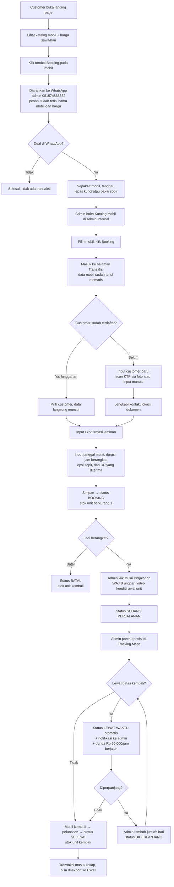

# 02 — Alur Bisnis

Dokumen ini menjelaskan perjalanan lengkap dari customer melihat website sampai
mobil kembali dan transaksi ditutup.

## Diagram Alur



## Penjelasan Per Tahap

### Tahap 1 — Customer menemukan mobil (landing page)

Customer membuka website dan melihat katalog. Setiap kartu mobil menampilkan
foto, nama, spesifikasi ringkas, dan **harga jual per hari**. Harga modal tidak
pernah ditampilkan di sisi publik.

### Tahap 2 — Perpindahan ke WhatsApp

Customer menekan tombol booking pada mobil yang diminati. Website membuka
WhatsApp ke nomor admin **081574865632** dengan pesan yang sudah terisi
otomatis, minimal berisi nama mobil dan harga per hari.

Format tautan: `https://wa.me/6281574865632?text=<pesan>`

### Tahap 3 — Negosiasi & kesepakatan (di luar sistem)

Percakapan terjadi sepenuhnya di WhatsApp. Yang harus tercapai sebelum masuk
sistem:

- Mobil yang disepakati
- Tanggal pergi dan tanggal pulang (atau durasi)
- Jam berangkat
- **Lepas kunci atau pakai sopir** (sopir + Rp 500.000/hari)
- Jaminan yang akan dititipkan
- Besaran DP

### Tahap 4 — Admin membuat booking dari katalog internal

Admin login, membuka **Katalog Mobil**, memilih mobil yang disepakati, lalu
menekan tombol **Booking**. Sistem memindahkan admin ke halaman **Transaksi**
dengan data mobil sudah terisi otomatis.

### Tahap 5 — Menentukan customer

- **Customer langganan** — admin mencari nama/No. HP, data lama langsung muncul
  lengkap dengan dokumen dan jaminan.
- **Customer baru** — admin menginput lewat **scan KTP** (OCR mengisi field,
  hasilnya masih bisa dikoreksi sebelum disimpan) atau **input manual**.

Detail field ada di [05 — Model Data](05-model-data.md).

### Tahap 6 — Jaminan

Customer menitipkan jaminan, umumnya **motor**: kendaraan apa yang dititipkan
dan atas nama siapa. Jaminan tersimpan di data customer supaya bisa dipakai
lagi, tetapi bisa diinput ulang per transaksi kalau kendaraannya berbeda.

### Tahap 7 — Input detail sewa

Admin mengisi:

| Field | Keterangan |
|---|---|
| Tanggal mulai sewa | Tanggal pengambilan mobil |
| Durasi (hari) | Lama sewa |
| Jam berangkat | Jam pengambilan — juga jadi patokan jam pengembalian |
| Layanan | **Lepas kunci** atau **Dengan sopir** (+Rp 500.000/hari) |
| DP diterima | Uang muka yang sudah dibayar customer |

**Dihitung otomatis:**

- Tanggal selesai = tanggal mulai + durasi
- Biaya sewa = harga jual/hari × durasi
- Biaya sopir = Rp 500.000 × durasi (kalau pakai sopir)
- Total tagihan = biaya sewa + biaya sopir + denda (kalau ada)
- Sisa tagihan = total tagihan − total yang sudah dibayar

Setelah disimpan, status menjadi **Booking** dan unit tersedia berkurang satu.

### Tahap 8 — Berangkat: video kondisi awal wajib

Admin menekan tombol **Mulai Perjalanan**. Sebelum status berpindah, sistem
**mewajibkan admin mengunggah video kondisi awal mobil**. Video ini jadi bukti
keadaan unit saat diserahkan — dipakai kalau ada sengketa baret, penyok, atau
kelengkapan yang hilang saat pengembalian.

Tanpa video, tombol tidak bisa diteruskan. Status lalu menjadi
**Sedang Perjalanan**.

### Tahap 9 — Siklus status

```
                    ┌──────────────► BATAL (stok kembali)
                    │
BOOKING ────────────┴──► SEDANG PERJALANAN ──────────────► SELESAI
   (video wajib di sini)          │                            ▲
                                  ▼ (otomatis, lewat batas)    │
                             LEWAT WAKTU ──(+n hari)──► DIPERPANJANG
                                  │                            │
                                  └────────────────────────────┘
```

| Status | Arti | Menahan unit? |
|---|---|---|
| **Booking** | Sudah dipesan, mobil belum berangkat | Ya |
| **Sedang Perjalanan** | Mobil sudah dibawa customer | Ya |
| **Lewat Waktu** | Melewati batas pengembalian — **berubah otomatis** | Ya |
| **Diperpanjang** | Sewa ditambah beberapa hari oleh admin | Ya |
| **Selesai** | Mobil kembali, tagihan lunas | Tidak |
| **Batal** | Booking dibatalkan sebelum berangkat | Tidak |

Aturan:

- Perpindahan status dilakukan admin, **kecuali Lewat Waktu** yang muncul
  otomatis begitu waktu pengembalian terlampaui.
- **Batal hanya dari status Booking** — setelah mobil jalan tidak bisa dibatalkan.
- Status Selesai dan Batal sama-sama mengembalikan unit ke stok.

### Tahap 10 — Lewat waktu, denda, dan perpanjangan

Batas pengembalian = tanggal selesai pada **jam yang sama dengan jam berangkat**.

Begitu terlampaui:

1. Status berubah otomatis menjadi **Lewat Waktu**.
2. Admin menerima **notifikasi di dalam aplikasi** (lonceng + daftar di dashboard).
3. **Denda berjalan Rp 50.000 per jam** dan ikut masuk ke total tagihan.

Dari sini admin punya dua pilihan:

- **Perpanjang** — masukkan tambahan berapa hari. Sewa diperpanjang, status
  menjadi **Diperpanjang**, dan biaya sewa bertambah sesuai jumlah hari baru.
- **Selesaikan** — mobil dikembalikan, denda ditagih bersama pelunasan, status
  menjadi **Selesai**.

### Tahap 11 — Pembayaran

Pembayaran dicatat di sistem, bukan hanya diingat:

| Jenis | Kapan |
|---|---|
| **DP** | Saat booking dibuat |
| **Pelunasan** | Saat mobil dikembalikan |
| **Denda** | Kalau ada overtime |

Status pembayaran dihitung dari total yang sudah masuk:

- **Belum Bayar** — belum ada pembayaran
- **DP** — sudah bayar sebagian
- **Lunas** — total dibayar ≥ total tagihan

### Tahap 12 — Pemantauan & pelaporan

Selama mobil di luar, admin bisa melihat posisi di modul **Tracking Maps**.
Setelah **Selesai**, transaksi masuk rekap dan bisa di-export ke Excel dengan
filter `startDate` dan `endDate`.
