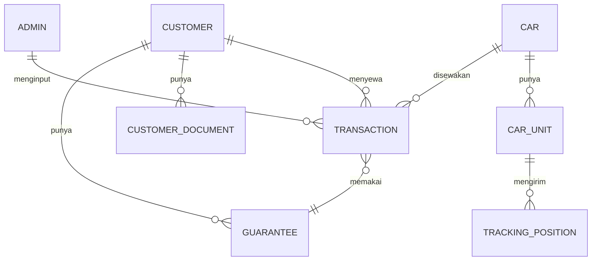

# 05 — Model Data

Draft entitas untuk database. Ini rancangan awal, masih bisa berubah saat
implementasi — tapi bentuk relasinya sebaiknya dipertahankan.

## Diagram Relasi

---

## Admin

Akun internal untuk login.

| Field | Tipe | Keterangan |
|---|---|---|
| id | id | |
| name | string | Nama admin |
| email | string unik | Dipakai untuk login |
| passwordHash | string | Hash, tidak pernah plaintext |
| isActive | boolean | Bisa dinonaktifkan tanpa dihapus |
| createdAt / updatedAt | datetime | |

---

## Car (katalog mobil)

| Field | Tipe | Keterangan |
|---|---|---|
| id | id | |
| slug | string unik | Untuk URL landing page |
| name | string | Contoh: Toyota Avanza 2022 |
| category | enum | Sedan / SUV / MPV / Minivan / Pickup / dll. |
| description | text | Tampil di landing page |
| imageUrl | string | Foto utama |
| gallery | string[] | Foto tambahan |
| specTransmission | string | Manual / Automatic |
| specFuel | string | Bensin / Diesel / Hybrid / Listrik |
| specSeats | int | Jumlah kursi |
| specDoors | int | Jumlah pintu |
| specAirConditioner | boolean | |
| **sellPricePerDay** | int (Rupiah) | Harga jual — tampil di landing page |
| **costPricePerDay** | int (Rupiah) | Harga modal — internal saja |
| **totalUnit** | int | Jumlah unit yang dimiliki |
| isPublished | boolean | Tampil di landing page atau tidak |
| createdAt / updatedAt | datetime | |

**Turunan (dihitung, tidak disimpan):**
`availableUnit = totalUnit − jumlah transaksi berstatus BOOKING atau ON_TRIP`

---

## CarUnit (opsional, kalau tiap unit dibedakan)

Dipakai kalau satu model mobil punya beberapa unit fisik dengan plat berbeda —
dan dibutuhkan untuk tracking per unit.

| Field | Tipe | Keterangan |
|---|---|---|
| id | id | |
| carId | ref → Car | |
| plateNumber | string | Nomor polisi |
| trackerDeviceId | string | ID perangkat GPS tracker |
| isActive | boolean | |

> Kalau tracking belum dipasang di semua mobil, tabel ini boleh menyusul di
> tahap kedua. Untuk versi pertama, transaksi cukup menunjuk ke `Car`.

---

## Customer

### Identitas (dari KTP)

| Field | Tipe |
|---|---|
| id | id |
| nik | string unik |
| fullName | string |
| birthPlace | string |
| birthDate | date |
| gender | enum (L / P) |
| address | text |
| rtRw | string |
| village | string (kelurahan/desa) |
| district | string (kecamatan) |
| religion | string |
| maritalStatus | string |
| occupationKtp | string (pekerjaan sesuai KTP) |
| nationality | string |

### Kontak & data tambahan

| Field | Tipe | Keterangan |
|---|---|---|
| phoneWa | string | No. HP (WhatsApp) — **wajib** |
| email | string | Email aktif |
| socialInstagram | string | |
| socialTiktok | string | |
| emergencyName | string | Nama kontak darurat |
| emergencyRelation | string | Hubungan (orang tua / saudara / dll.) |
| emergencyPhone | string | Nomor kontak darurat |
| houseStatus | enum | MILIK / SEWA / KOS |
| occupationDetail | string | Pekerjaan / usaha / kampus |

### Lokasi

| Field | Tipe | Keterangan |
|---|---|---|
| mapsLink | string | Link lokasi Google Maps rumah |
| housePhotoUrl | string | Foto depan rumah |

### Meta

| Field | Tipe | Keterangan |
|---|---|---|
| ktpScanned | boolean | Data diisi lewat scan KTP atau manual |
| notes | text | Catatan admin |
| createdAt / updatedAt | datetime | |

---

## CustomerDocument

| Field | Tipe | Keterangan |
|---|---|---|
| id | id | |
| customerId | ref → Customer | |
| type | enum | KTP / KK / SIM / NPWP / LAINNYA |
| fileUrl | string | Lokasi berkas |
| fileName | string | |
| uploadedAt | datetime | |

> Foto KTP hasil scan otomatis dibuatkan record dengan `type = KTP`.

---

## Guarantee (jaminan)

| Field | Tipe | Keterangan |
|---|---|---|
| id | id | |
| customerId | ref → Customer | Pemilik data jaminan |
| vehicleType | string | Motor apa yang dititipkan (merek/tipe) |
| plateNumber | string | Nomor plat |
| ownerName | string | **Atas nama siapa** — bisa beda dari customer |
| photoUrl | string | Foto kendaraan / STNK (opsional) |
| isActive | boolean | Jaminan lama bisa dinonaktifkan |
| createdAt | datetime | |

Satu customer bisa punya lebih dari satu jaminan. Transaksi menunjuk jaminan
mana yang dipakai, atau membuat jaminan baru kalau kendaraannya berbeda.

---

## Transaction

| Field | Tipe | Keterangan |
|---|---|---|
| id | id | |
| code | string unik | Kode transaksi, contoh `TRX-20260801-001` |
| carId | ref → Car | |
| carUnitId | ref → CarUnit | Opsional |
| customerId | ref → Customer | |
| guaranteeId | ref → Guarantee | Jaminan yang dipakai di transaksi ini |
| **startDate** | date | Tanggal mulai sewa |
| **durationDays** | int | Durasi (hari) |
| **departureTime** | time | Jam berangkat |
| endDate | date | **Dihitung:** startDate + durationDays |
| sellPricePerDay | int | **Snapshot** harga jual saat booking |
| costPricePerDay | int | **Snapshot** harga modal saat booking |
| totalSell | int | sellPricePerDay × durationDays |
| totalCost | int | costPricePerDay × durationDays |
| profit | int | totalSell − totalCost |
| status | enum | BOOKING / ON_TRIP / DONE |
| notes | text | Catatan admin |
| createdByAdminId | ref → Admin | Siapa yang menginput |
| createdAt / updatedAt | datetime | |

**Kenapa harga di-snapshot:** kalau harga di katalog diubah bulan depan,
transaksi lama harus tetap memakai harga yang berlaku saat booking. Tanpa
snapshot, rekap dan laba historis jadi salah.

### Enum status

| Nilai | Label di UI |
|---|---|
| `BOOKING` | Booking |
| `ON_TRIP` | Sedang Perjalanan |
| `DONE` | Selesai |

---

## TrackingPosition

Riwayat posisi mobil. Bentuk pastinya tergantung sumber data yang dipilih
(lihat [06 — Keputusan Teknis](06-keputusan-teknis.md#tracking-maps)).

| Field | Tipe | Keterangan |
|---|---|---|
| id | id | |
| carUnitId | ref → CarUnit | |
| latitude | float | |
| longitude | float | |
| speed | float | km/jam, kalau tersedia |
| recordedAt | datetime | Waktu posisi terekam di perangkat |

> Kalau posisi hanya dibaca langsung dari API vendor tracker secara real-time
> tanpa perlu riwayat, tabel ini belum dibutuhkan di versi pertama.
