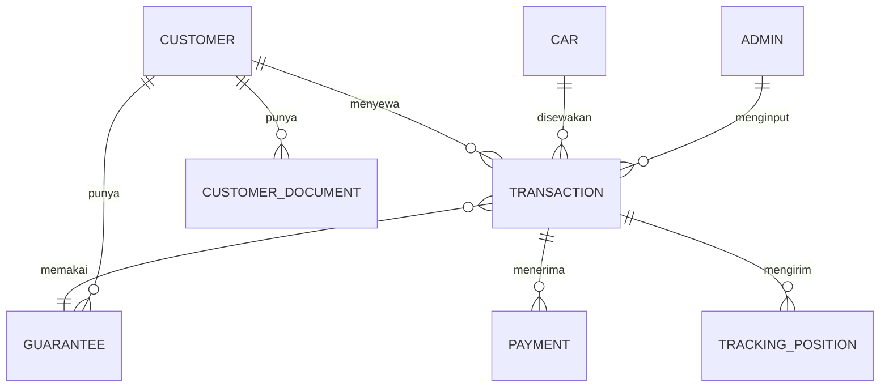

# 05 — Model Data

Draft entitas untuk database. Ini rancangan awal, masih bisa berubah saat
implementasi — tapi bentuk relasinya sebaiknya dipertahankan.

## Diagram Relasi



---

## Admin

Akun internal untuk login.

| Field | Tipe | Keterangan |
|---|---|---|
| id | id | |
| name | string | Nama admin |
| email | string unik | Dipakai untuk login |
| passwordHash | string | Hash, tidak pernah plaintext |
| **role** | enum | `SUPER_ADMIN` (Owner) atau `ADMIN` (Staf) |
| isActive | boolean | Bisa dinonaktifkan tanpa dihapus |
| createdAt / updatedAt | datetime | |

Hanya `SUPER_ADMIN` yang boleh menerima data harga modal, margin, dan laba.

---

## Car (katalog mobil)

| Field | Tipe | Keterangan |
|---|---|---|
| id | id | |
| slug | string unik | Untuk URL landing page |
| name | string | Contoh: Toyota Avanza 2022 |
| category | enum | MPV / SUV / Hatchback / Minibus |
| description | text | Tampil di landing page |
| imageUrl | string | Foto utama |
| gallery | string[] | Foto tambahan |
| specTransmission | string | Manual / Automatic |
| specFuel | string | Bensin / Diesel / Hybrid / Listrik |
| specSeats | int | Jumlah kursi |
| specDoors | int | Jumlah pintu |
| specAirConditioner | boolean | |
| **sellPricePerDay** | int (Rupiah) | Harga jual — tampil di landing page |
| **costPricePerDay** | int (Rupiah) | Harga modal — internal saja |
| **totalUnit** | int | Jumlah unit yang dimiliki |
| isPublished | boolean | Tampil di landing page atau tidak |
| createdAt / updatedAt | datetime | |

**Turunan (dihitung, tidak disimpan):**

```
availableUnit = totalUnit − jumlah transaksi berstatus
                BOOKING, ON_TRIP, OVERTIME, atau EXTENDED
```

> **Tidak ada tabel CarUnit.** Sudah diputuskan bahwa unit tidak dibedakan per
> nomor plat — cukup hitungan jumlah unit per model. Transaksi menunjuk langsung
> ke `Car`.

---

## Customer

### Identitas (dari KTP)

| Field | Tipe |
|---|---|
| id | id |
| nik | string unik |
| fullName | string |
| birthPlace | string |
| birthDate | date |
| gender | enum (L / P) |
| address | text |
| rtRw | string |
| village | string (kelurahan/desa) |
| district | string (kecamatan) |
| religion | string |
| maritalStatus | string |
| occupationKtp | string (pekerjaan sesuai KTP) |
| nationality | string |

### Kontak & data tambahan

| Field | Tipe | Keterangan |
|---|---|---|
| phoneWa | string | No. HP (WhatsApp) — **wajib** |
| email | string | Email aktif |
| socialInstagram | string | |
| socialTiktok | string | |
| emergencyName | string | Nama kontak darurat |
| emergencyRelation | string | Hubungan (orang tua / saudara / dll.) |
| emergencyPhone | string | Nomor kontak darurat |
| houseStatus | enum | MILIK / SEWA / KOS |
| occupationDetail | string | Pekerjaan / usaha / kampus |

### Lokasi

| Field | Tipe | Keterangan |
|---|---|---|
| mapsLink | string | Link lokasi Google Maps rumah |
| housePhotoUrl | string | Foto depan rumah |

### Meta

| Field | Tipe | Keterangan |
|---|---|---|
| ktpScanned | boolean | Data diisi lewat scan KTP atau manual |
| notes | text | Catatan admin |
| createdAt / updatedAt | datetime | |

---

## CustomerDocument

| Field | Tipe | Keterangan |
|---|---|---|
| id | id | |
| customerId | ref → Customer | |
| type | enum | KTP / KK / SIM / NPWP / LAINNYA |
| fileUrl | string | Lokasi berkas |
| fileName | string | |
| uploadedAt | datetime | |

> Foto KTP hasil scan otomatis dibuatkan record dengan `type = KTP`.

---

## Guarantee (jaminan)

| Field | Tipe | Keterangan |
|---|---|---|
| id | id | |
| customerId | ref → Customer | Pemilik data jaminan |
| vehicleType | string | Motor apa yang dititipkan (merek/tipe) |
| plateNumber | string | Nomor plat |
| ownerName | string | **Atas nama siapa** — bisa beda dari customer |
| photoUrl | string | Foto kendaraan / STNK (opsional) |
| isActive | boolean | Jaminan lama bisa dinonaktifkan |
| createdAt | datetime | |

Satu customer bisa punya lebih dari satu jaminan. Transaksi menunjuk jaminan
mana yang dipakai, atau membuat jaminan baru kalau kendaraannya berbeda.

---

## Transaction

| Field | Tipe | Keterangan |
|---|---|---|
| id | id | |
| code | string unik | Kode transaksi, contoh `TRX-20260801-001` |
| carId | ref → Car | |
| customerId | ref → Customer | |
| guaranteeId | ref → Guarantee | Jaminan yang dipakai di transaksi ini |
| **startDate** | date | Tanggal mulai sewa |
| **durationDays** | int | Durasi (hari), bertambah kalau diperpanjang |
| **departureTime** | time | Jam berangkat — juga patokan jam pengembalian |
| sellPricePerDay | int | **Snapshot** harga jual saat booking |
| costPricePerDay | int | **Snapshot** harga modal saat booking |
| withDriver | boolean | Lepas kunci (false) atau dengan sopir (true) |
| driverPricePerDay | int | **Snapshot** harga sopir (Rp 500.000) |
| driverCostPerDay | int | **Snapshot** upah sopir — internal, masih perlu dikonfirmasi |
| handoverVideoUrl | string | Video kondisi awal unit. **Wajib** sebelum ON_TRIP |
| handoverVideoAt | datetime | Kapan video diunggah |
| extendedDays | int | Total hari tambahan dari perpanjangan (0 kalau tidak) |
| status | enum | Lihat tabel di bawah |
| cancelledAt | datetime | Diisi kalau dibatalkan |
| cancelReason | text | Alasan pembatalan |
| notes | text | Catatan admin |
| createdByAdminId | ref → Admin | Siapa yang menginput |
| createdAt / updatedAt | datetime | |

**Kenapa harga di-snapshot:** kalau harga di katalog diubah bulan depan,
transaksi lama harus tetap memakai harga yang berlaku saat booking. Tanpa
snapshot, rekap dan laba historis jadi salah. Berlaku juga untuk harga sopir.

### Turunan (dihitung, tidak disimpan)

```
endDate       = startDate + durationDays
returnDeadline= endDate pada jam departureTime
overtimeHours = maks(0, sekarang − returnDeadline) dalam jam
lateFee       = overtimeHours × 50.000
rentalFee     = sellPricePerDay × durationDays
driverFee     = withDriver ? driverPricePerDay × durationDays : 0
grandTotal    = rentalFee + driverFee + lateFee
totalPaid     = jumlah semua Payment
outstanding   = grandTotal − totalPaid
totalCost     = (costPricePerDay + (withDriver ? driverCostPerDay : 0)) × durationDays
profit        = grandTotal − totalCost      ← Super Admin saja
```

### Enum status

| Nilai | Label di UI | Menahan unit? |
|---|---|---|
| `BOOKING` | Booking | Ya |
| `ON_TRIP` | Sedang Perjalanan | Ya |
| `OVERTIME` | Lewat Waktu | Ya |
| `EXTENDED` | Diperpanjang | Ya |
| `DONE` | Selesai | Tidak |
| `CANCELLED` | Batal | Tidak |

> `OVERTIME` **dihitung saat data dibaca**, bukan disimpan lewat cron. Kalau
> `status ∈ {ON_TRIP, EXTENDED}` dan `sekarang > returnDeadline`, status yang
> ditampilkan adalah `OVERTIME`. Ini menghindari job terjadwal yang bisa gagal
> jalan dan meninggalkan status ngambang.

---

## Payment

Riwayat pembayaran per transaksi. Satu transaksi bisa punya banyak pembayaran.

| Field | Tipe | Keterangan |
|---|---|---|
| id | id | |
| transactionId | ref → Transaction | |
| type | enum | `DP` / `SETTLEMENT` (pelunasan) / `LATE_FEE` (denda) |
| amount | int (Rupiah) | |
| method | enum | `CASH` / `TRANSFER` |
| paidAt | datetime | |
| recordedByAdminId | ref → Admin | |
| note | text | |

**Status pembayaran (dihitung):**

| Kondisi | Label |
|---|---|
| `totalPaid = 0` | Belum Bayar |
| `0 < totalPaid < grandTotal` | DP |
| `totalPaid ≥ grandTotal` | Lunas |

---

## TrackingPosition

Riwayat posisi mobil. Bentuk pastinya tergantung sumber data yang dipilih
(lihat [06 — Keputusan Teknis](06-keputusan-teknis.md#tracking-maps)).

| Field | Tipe | Keterangan |
|---|---|---|
| id | id | |
| transactionId | ref → Transaction | Diikat ke transaksi, bukan ke plat |
| latitude | float | |
| longitude | float | |
| speed | float | km/jam, kalau tersedia |
| recordedAt | datetime | Waktu posisi terekam di perangkat |

> Kalau posisi hanya dibaca langsung dari API vendor tracker secara real-time
> tanpa perlu riwayat, tabel ini belum dibutuhkan di versi pertama.
